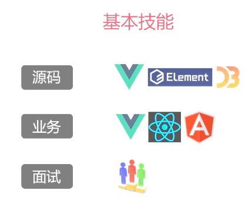
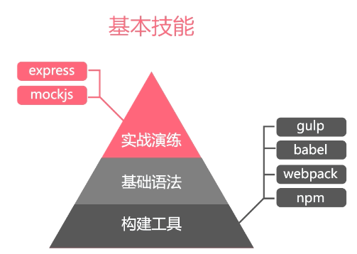
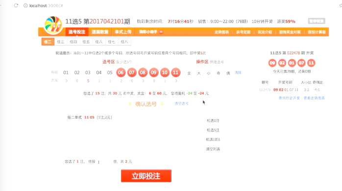
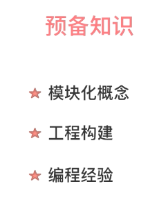

es6与es5代码的比较，下面的是对象拷贝的代码

```
//js写法
var createAssigner = function (keysFunc, defaults) {
        return function (obj) {
            var length = arguments.length;
            if (defaults) obj = Object(obj);
            if (length < 2 || obj == null) return obj;
            for (var index = 1; index < length; index++) {
                var source = arguments[index], keys = keysFunc(source), l = keys.length;
                for (var i = 0; i < l; i++) {
                    var key = keys[i];
                    if (!defaults || obj[key] === void 0)
                        obj[key] = source[key]
                }
            }
            return obj;

        };

    };

    var allKeys = function (obj) {
        var keys = [];
        for (var key in obj) keys.push(key);
        return keys;
    }
    var extend = createAssigner(allKeys);
    extend({ t: 1 }, { k: 2 })
```

```
//es6写法
Object.assign({t:1},{k:2})
```


## 字符串模版

```
//es5
 var compiled = _.template("hello:<%=name %>");
    compiled({ name: 'moe' });
```

```
//es6
var name = 'moe';
    var txt = `hello ${name}`
```

比较来说,es5比es6多会加载一个第三方的库，第二种也是更加简洁

## 更多特性

解构赋值 、箭头函数、set和Map、异步操作、类与对象、模块化

## 基本技能





项目的界面





