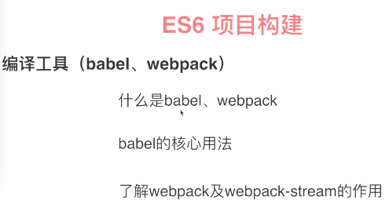

gulp-sass转换成css有一个编译的识别，文件合并等，模块依赖让机器自动完成的。


编译支持到es3,这样可以兼容到ie8这些低版本的。


先去gulp中文网看一下API



webpack在gulp是通过webpack-stream来的。


## 项目布局

```
|——app                            //放置前端的代码
    |——css
    |——js
        |——class                    //创建一个空的类文件
            |——test.js            
        |——index.js                 //入口文件
    |——views
        |——error.ejs            //创建错误的文件
        |——index.ejs                    
|——server                          //放置服务器的文件
|——tasks                       //构建工具的目录
```
1. 下载node 以及express脚手架`npm install express-generator -g`
2. `express -e .` express就是express脚手架，.表示在当前文件执行
3. 回到构建工具所在目录
```
tasks$ mkdir util
tasks$ touch util/args.js
```
4. 回到跟目录。`npm init`创建package.json
5. `es6$ touch .babelrc` babel配置的时候自动找这个文件
6. gulp配置文件，这里不使用gulpfile.js而是gulpfile.babel.js，因为我们这里使用的是es6的语法，如果不在babel的时候再执行babel脚本的时候会报错的。
7. 开始编码的过程了，脚本要处理命令行参数，引入一个包 .option这里的option就是`gulp -production`这个'-'
8. 创建scripts。js脚本 写好后安装包
```
es6$
npm install gulp gulp-if gulp-concat webpack webpack-stream vinyl-named gulp-livereload gulp-plumber gulp-rename gulp-uglify gulp-util yargs --save-dev
```

## 2-4 创建模版、服务任务脚本

新建tasks/scripts.js，tasks/css.js,tasks/pages.js,tasks/server.js

server.js的文件


## 2-5 把写好的目录自动完成

创建浏览器一个监听相关的文件，app是原始目录，把写在app里面的文件能够自动编译到server或者tasks里面。

创建了一个task/util.js的文件
`npm install gulp-live-server gulp-if del gulp-util --save-dev`

新建borwser.js

新建clean.js

新建build.js.

新建default.js

先装一下babel-loader的安装包。
`npm install babel-loader babel-core babel-preset-env webpack --save-dev`

gulpfile.babel.js是空的，写东西进去

再装一下这个包`npm install require-dir --save-dev `

配置.babelrc,要先安装一个包的`npm install babel-preset-es2015 --save-dev `
讲一下如果代码要兼容ie8的话那么就要配置一下babelrc文件

`npm install gulp-sequence --save-dev`

`gulp --watch`之后输入localhost:3000打开页面。我们使用的是express搭建的服务器，那么就是空的。

下面是一篇配置的讲解，不完全对
[csdn上task各文件讲解](https://blog.csdn.net/weixin_42298964/article/details/80695267)

接收热更新的东西，加上一句话。就是上面介绍要加上的。结下来几章的文章全部都在02-06里面.

不建议大家按照目录结构去敲，去下载源码，去代码上面的去理解。发现那里不理解则去看视频。