# 03-01  lesson1.js let和const

es5有两个作用域，一个是全局，一个是函数作用域，在es6中新增加了一个叫做块级作用域。

引入文件是在入口文件index.js处。
引入文件使用import

1. 怎么区分块作用域？

如果有大括号包围那么就是块作用域。包括for循环和if等的大括号。在大括号以外可以理解为生命周期结束了。

2. 没有声明报的应该是undefined,怎么会报错呢？
  因为是严格模式，严格模式es6不需要`use strict`也是严格模式,变量未声明不能引用。

3. 使用let不能重复声明变量

4. const和let在块作用域上是相同的，声明的时候必须要赋值

5. const对象的时候发现可以修改。对象是引用类型。

```
function last() {
    const PI = 3.1415926;
    const k = {
        a: 1
    }
    k.b=3
    console.log(PI, k)

}
last()
```

## 03-02 解构赋值

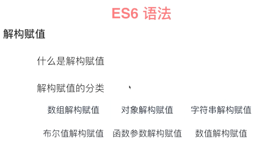

1. 解构就是左边一种结构，右边一种结构，左右一一对应进行赋值。
2. 什么叫数组解构赋值就是左右两边都是数组。
3. 左右都是对象叫对象解构赋值
4. 左边是数组，右边是字符串叫字符串解构赋值
5. 布尔值解构和数值解构归根结底都属于对象解构赋值的一种，那为什么单独拿出来说呢？数组，对象，字符串是不是都是js对象中经常提到的数据类型。
6. 函数参数解构赋值其实就是数组结构赋值在函数参数这里的一个应用。

* 数组解构赋值和对象解构赋值的方法以及默认值和使用场景。

>总结：

1. 数组可以数值交换
2. 获取到对象中的值，对象赋值解构
3. 数组返回多个值的情况下只要我要的某几个值
4. 数组返回单个的变量值
5. 对象赋值解构 对象值被重新赋值


## 3-3 正则扩展 lesson3.js


* es6中对构造函数增加了一种方式。

```
let regex3=new RegExp(/xyz/ig,'i');//在es6中这里可以是两个参数 i和g
    console.log(regex3.flags);//后面的i会覆盖前面的修饰符
```
* 'g'和'y'的不同点，'g'是可以从上次匹配的位置之后再匹配的，但是'y'只能从第一个位置去匹配
* es6中增加了'y'和'u'修饰符，'u'就是unicode，字符编码
* 正则表达式中的.是可以匹配任何代码字符的，其实unicode编码超过连哥哥字节就不能识别了
* 如果你的unicode字符串中有的字符是大于两个字节的一定要加上'u'修饰符才能正确识别
* '.'还有四个字符是不能处理的，如换行符，回车符，行分隔符，段分隔符，如果遇到了怎么处理呢？就是使用s修饰符，但是目前es6还没有实现。

## 3-4字符串扩展（上）lesson4.js

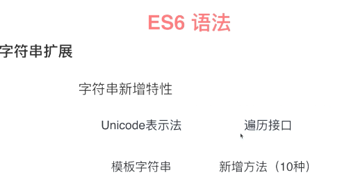

刚才提到的二到三个是es7的，如果不打补丁的话那么在es6中编译是没法通过的，安装一个补丁库处理兼容的，就是安装babel-polify `npm install babel-polify --save-dev` ，同时要在入口文件引用兼容库
* 讲了unicode编码的长度问题，一个API codePointAt()以及charAt,charCodeAt
* fromCharCode和fromCodePoint
* 字符串便利器接口let of 


## 3-5 字符串扩展(下) lesson4.js

* 判断字符串中是不是包含某些字符。includes
* 判断字符串是不是以哪些为起始的和结束的startsWith,endsWith
* 重复
* 模版拼接
* es7的草案，加了polify的话也可以使用的 padStart,padEnd 很有用
* 标签模版，第一怎么用，第二到那里用（常见的场景）
* String.raw

## 3-6 数值扩展 lesson5.js

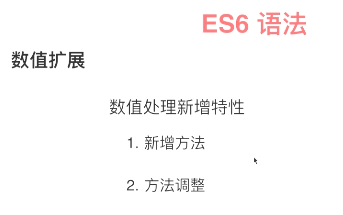

1. 在es6的二进制和8进制度
2. 判断是不是有尽头的
3. Number.isInteger判断是不是整数
4. 最大上线和最小下线
5. 取一个小数的整数部分
6. 判断一个数是整数，负数还是0
7. 立方根
8. 对角函数，对数方法等，用到的时候再查

## 3-7 数组扩展 lesson6.js

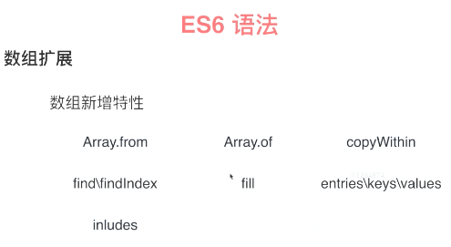

1. Array.of() 把一组数据对象转换为数组类型
2. Array.from()
3. fill()填充数组的功能
4. .keys(),.values()取元素下标和元素的值
5. copyWith
6. find(),findIndex()
7. includes() 判断是不是包含某个值，NaN也是可以判断的

## 3-8 函数扩展 lesson7.js

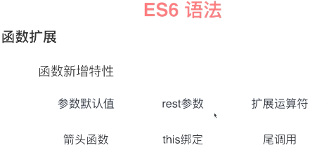

1. 传入参数设置一个值
2. ...把一系列的参数转换为一个数组
3. 把数组转换为一个离散的值...[1,2,3,4]
4. 箭头函数
5. 尾调用

## 3-9 对象扩展 lesson8.js
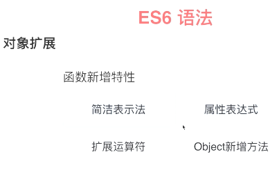

1. 简洁表达法
2. 对像里面的方法简化
3. 属性表达式
4. 判断两个字符串是不是相等的，但是引用类型的是没法判断的
5. entries
6. 扩展运算符


## 3-10 Symobol数据 类型 lesson10.js

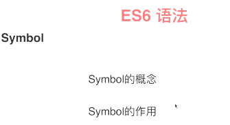

* symobol数据类型是新增加的数据类型。
* 二是Symbol是什么，以及它的作用

1. Symbol.for()
2. 对象中有用到Symbol做key值的话通过for in或者value of都是拿不到这个值的
3. for of拿不到Symbol属性
4. Object.getOwnPropertySymbols可以只拿到Symbol的属性
5. Reflect.ownKeys(obj)能把对象变为数组并且把数组的所有属性遍历出来

## 3-11 es6中的数据结构 lesson11.js

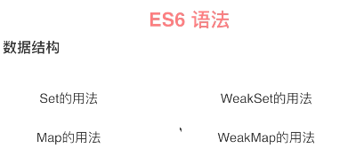

1. weakSet和weakMap是set和map的弱引用
2.  set集合中的元素是不能重复的，因此set是可以去重的
3.  map和object做对比，key和value,object中的key是字符串，map中的key可以是任意值
4. 向set里面添加元素要用add()这个方法
5. .keys()和values(),.entries(),forEach()返回的都是value的值 不加方法也是可以的
6. weakset和set有什么不一样

## 3-12 map和set的对比 lesson12.js

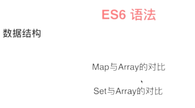

1. 在改和删上map比set要好用

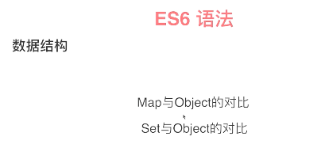

* map优先，尤其复杂的数据结构
* 要保证唯一性 就是用set，放弃传统的数组和object

## 3-13 Proxy和reflect lesson13.js

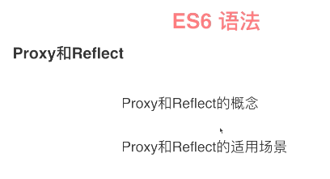

* proxy你可以理解为我们现实生活中有代理商，供应商等等。
* reflect是反射，
* reflect对象和proxy对象的方法是一摸一样的。也就是说会reflect就会用proxy

1. 不懂啊

## 3-14 类和对象

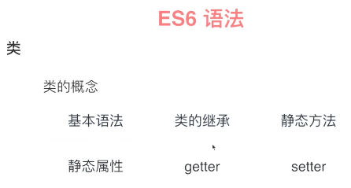

*  es6中多了getter和setter
*  块作用域

1. 讲了类的基本定义和生成实例
2. 继承-子怎么传递参数给父
3. 类中的getter和setter
4. 静态方法-静态方法是通过类去调用而不是类的实例
5. 静态属性

## 3-15 promise

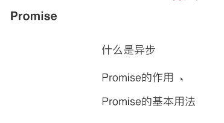

1. ajax模拟回调
2. promise.all
3. promise.race

## 3-16 iterator和for of循环

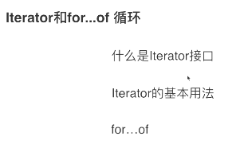

* for of循环的过程其实就是不断调用iterator接口来达到这种形式，
* 不用的数据结构通过for of统一的这种形式来达到读取不同数据的这样一个目标，

## 3-17  Generator

这是es6中偏高级的部分了

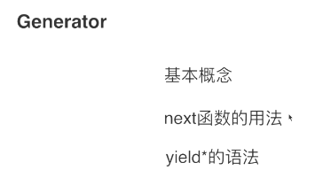;

* next和yield就是generator的一部分，遇到yield或return就停止了，next才开始
* gen函数和普通函数的区别就是有一个*

1. 

## 3-18 decorator 修饰器 

* 基本概念 -修饰器是一个函数，修改行为（扩展类的功能），修改类的行为(修饰器只在类的范畴有用，其他没用)。
* 基本用法 

1. 先安装一个包，babel-plugin-transform-decorators-legacy --save-dev

2. 再babelrc上面写上这个插件` "plugins":["transform-decorators-legacy"]`,

3. 第三方库core-decorators

4. 我没懂这个

## 3-19 模块化

es6模块化：
* 基本概念
* es6的模块化语法

1. 新建timer.js 计算倒计时的
2. calculate.js 选号区切换选号
3. interface.js  接口文件
4. 描述本身彩票的，上面三个在其他项目里面是可以用的， base.js  我的计算规则，我的彩票逻辑，玩法提示