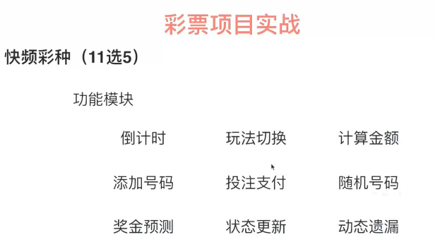
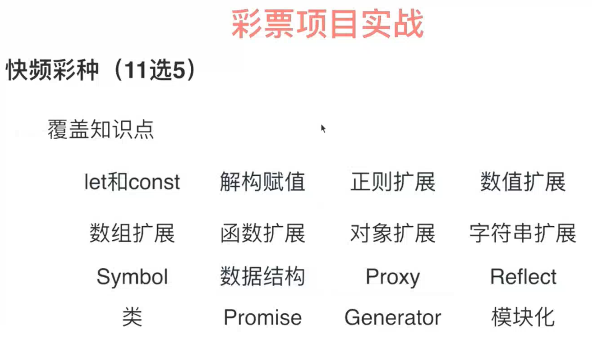

## 4-1 需求分析和目录创建 

模块化要解决的问题就是功能单一，有多个功能是可以划分出来的。

## 4-2 创建倒计时的模块 

编辑timer.js,

## 4-3   创建数据计算模块

上面那个模块只是声明类，并没有实例化。按照代码的结构呢是要有一个lottery把所有类继承，最后由lottery实例化，将继承的类都实例化才能保证代码的运行。

倒计时要后端给我们一个时间戳，要从那里开始倒计时。

把所有接口都封装到一个类里，一个服务端就是一个接口返回三个信息，分别是现在是多少期，倒计时时间，销售状态。

还有一个接口是返回遗漏那块的。遗漏是指这个号码有多少期没有出过了，这个是10分钟一期的。还有奖号也是需要一个接口。

引入jquery库。

fetch的兼容性不太好，不兼容ie8.

* 学会了import的使用
* class 声明类，如果不要属性只要方法的话可以不要constructor
* 类里面方法的声明,且每个方法之间没有','。
*   Promise对象解决了回调的问题，解决了异步处理的问题。
* 箭头函数的应用，以及this的指向，箭头函数的this指的是定义时候的，而不是运行时候的。
* 

##  4-4 创建接口模块（上） 

* 选那个号多少注，跟计算相关的方法都封装在一个类里面，

## 4-5 创建接口模块（下）

* 津贴 bonous,这里理解就行 算法是一个复杂点。

## 4-6 创建彩票基础模块（上）

* 分清楚map和set的区别

## 4-7 创建彩票基础模块（中）
* 

